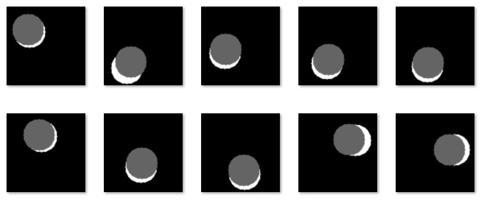

# predict_coords
Convolutional neural network (CNN) for predicting the coordinates of the center of a circle in an image.
## How to use
```python
import prepare_data as prep
import model

# generate some random data
prep.generate_data('data\\train', 30000)
prep.generate_data('data\\test', 1000)

# make and train new model
model.newCNNNetwork('test01')

# test model - print numerical results and draw predicted circle (grey) on original image (black with white circle)
model.predict()
```
## Results

